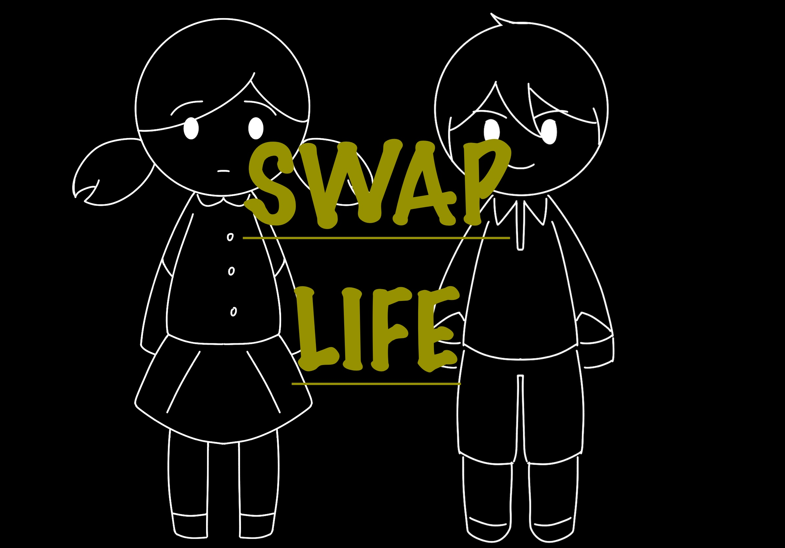
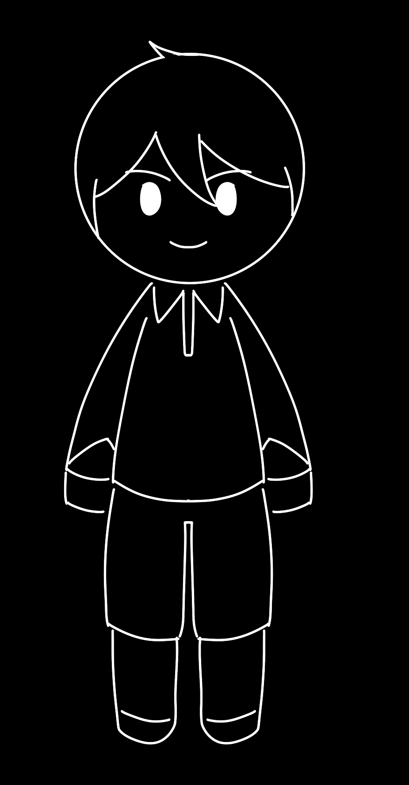
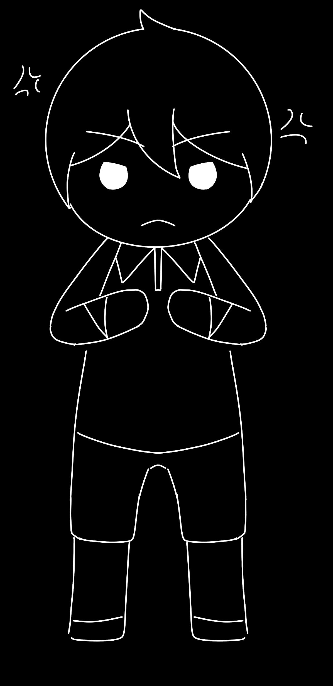
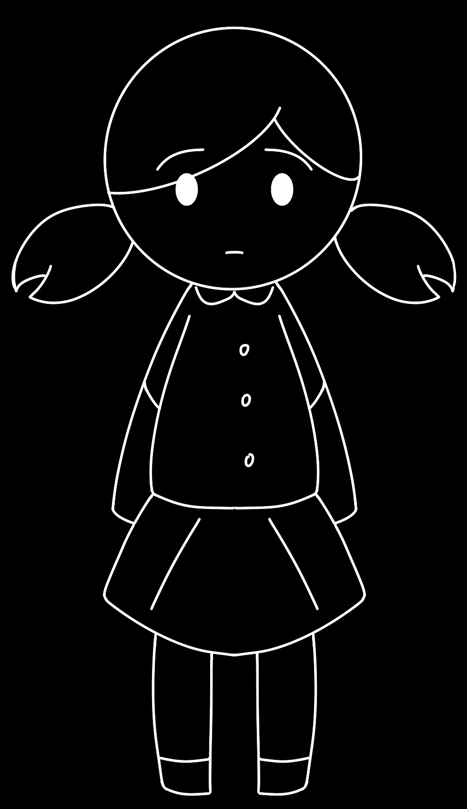
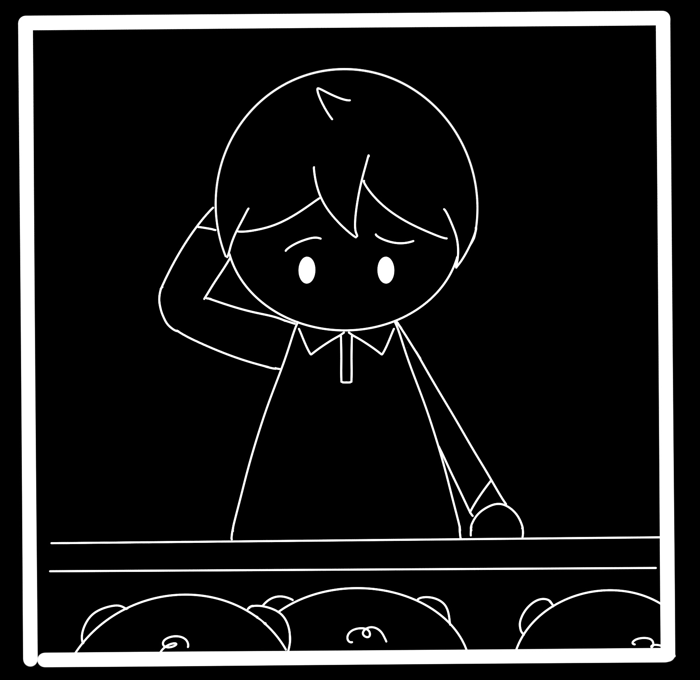
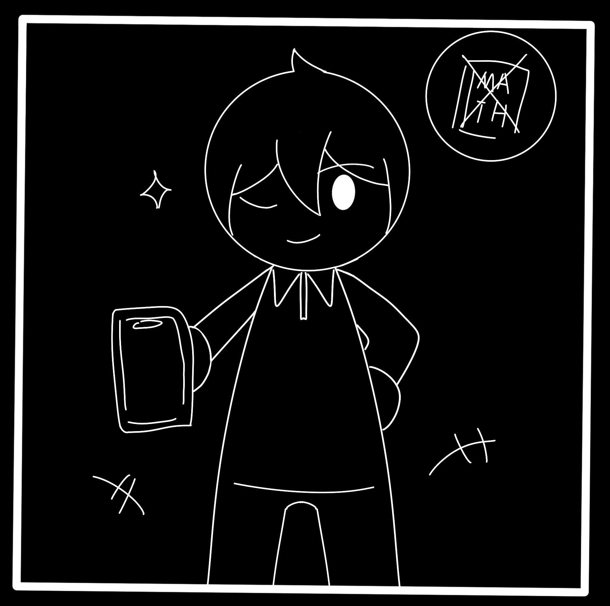
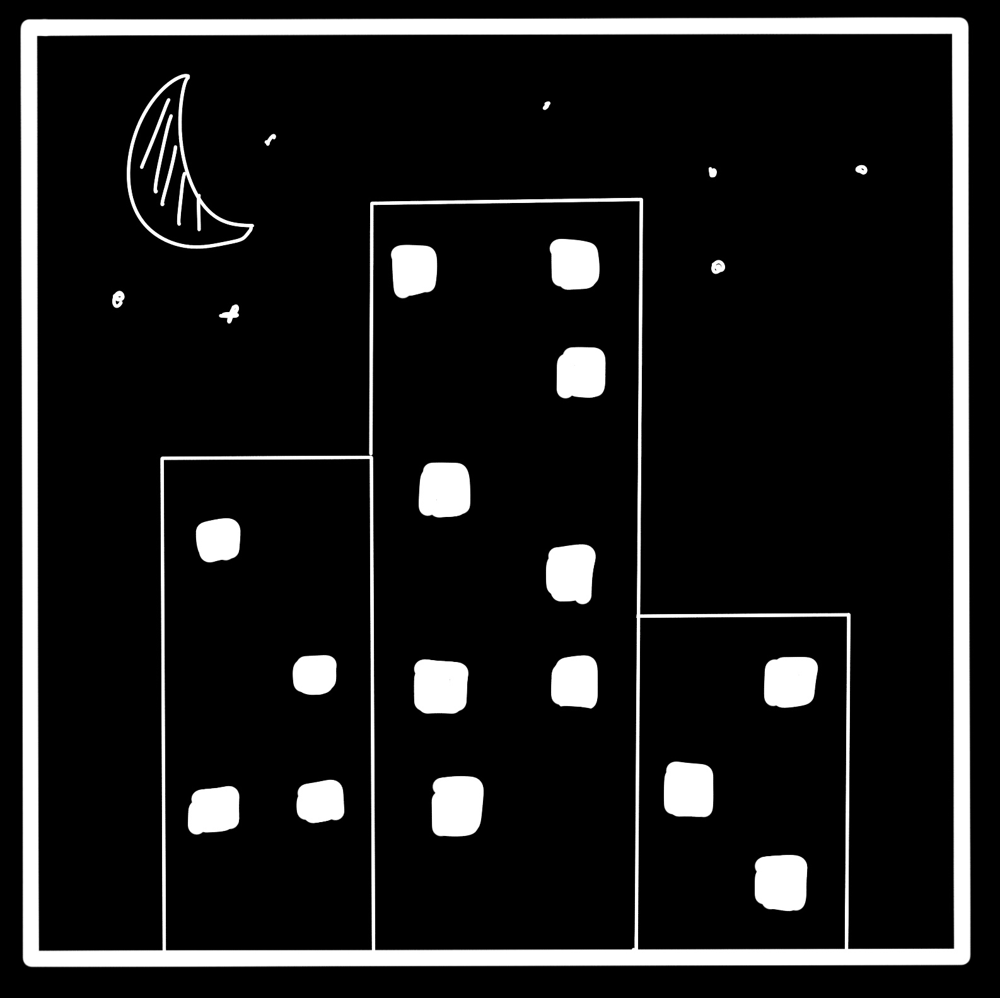
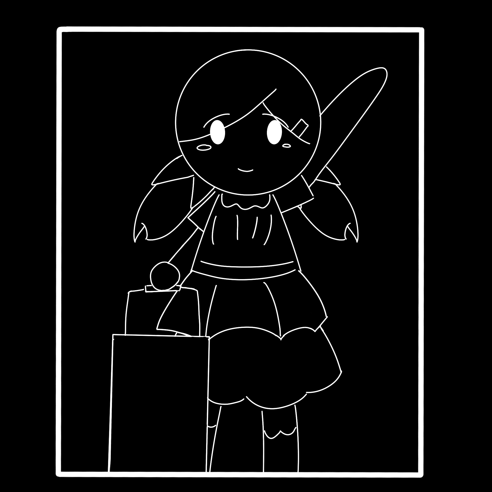
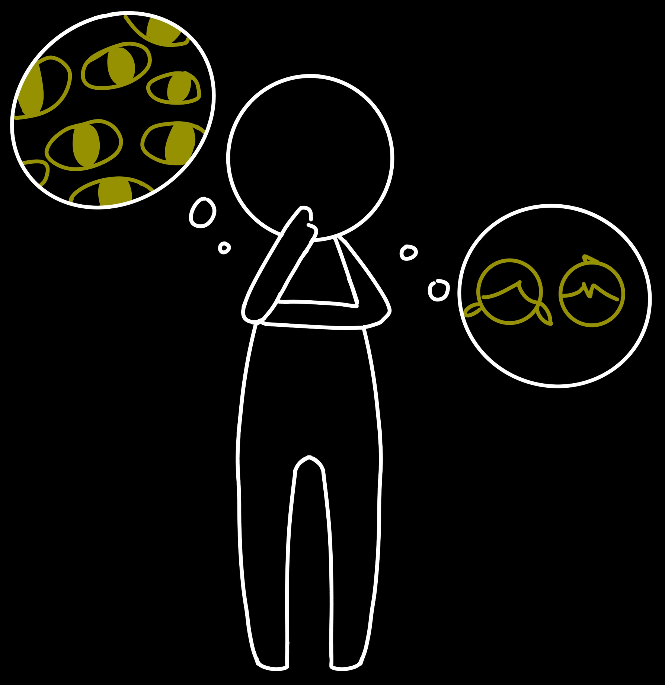

<audio controls="controls">
  <source type="audio/mp3" src="sounds/Introduction.mp3"> </source>
</audio>

<audio controls="controls">
  <source type="audio/mp3" src="sounds/Target1.mp3"> </source>
</audio>

<audio controls="controls">
  <source type="audio/mp3" src="sounds/Target2.mp3"> </source>
</audio>

<audio controls="controls">
  <source type="audio/mp3" src="sounds/Requre.mp3"> </source>
</audio>

<audio controls="controls">
  <source type="audio/mp3" src="sounds/continue.mp3"> </source>
</audio>

<audio controls="controls">
  <source type="audio/mp3" src="sounds/day1.mp3"> </source>
</audio>

<audio controls="controls">
  <source type="audio/mp3" src="sounds/day2.mp3"> </source>
</audio>

<audio controls="controls">
  <source type="audio/mp3" src="sounds/day3.mp3"> </source>
</audio>

<audio controls="controls">
  <source type="audio/mp3" src="sounds/day4.mp3"> </source>
</audio>

<audio controls="controls">
  <source type="audio/mp3" src="sounds/day5.mp3"> </source>
</audio>

<audio controls="controls">
  <source type="audio/mp3" src="sounds/day6.mp3"> </source>
</audio>

<audio controls="controls">
  <source type="audio/mp3" src="sounds/goodending2.mp3"> </source>
</audio>

<audio controls="controls">
  <source type="audio/mp3" src="sounds/badending.mp3"> </source>
</audio>

